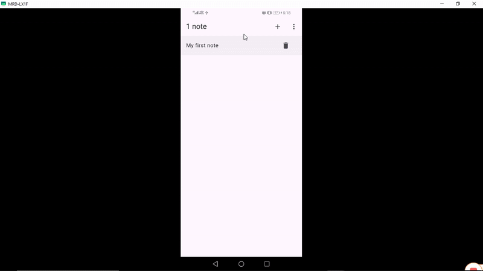

# 🚀 Notesy

# Description

An app to create and interact with your notes which supports localization (l10n) and internationalization (i18n)

---

## 🖼️ Demo

---

## 🧠 Tech Stack

**Frontend:** Dart, Flutter

**Backend:** Node.js / Firebase / Django

**Database:** Firestore / SQLite /

**Other Tools:** Figma, Git, Provider, DB Browser , Bloc

**App Icons & Sizing:** Stockio.com/appicon.co

---

## ⚙️ Setup Instructions

### 1. Clone the repo

git clone https://github.com/devdeejay27/notesy.git

cd vibes

### 2. Install dependencies

flutter clean

flutter pub get

### 3. Run the app in terminal

flutter run

## 🧪 Running Tests

flutter test

## 👨‍💻 Author

Chukwudumeje

@devdeejay27

📧 dum_obieli@yahoo.com
